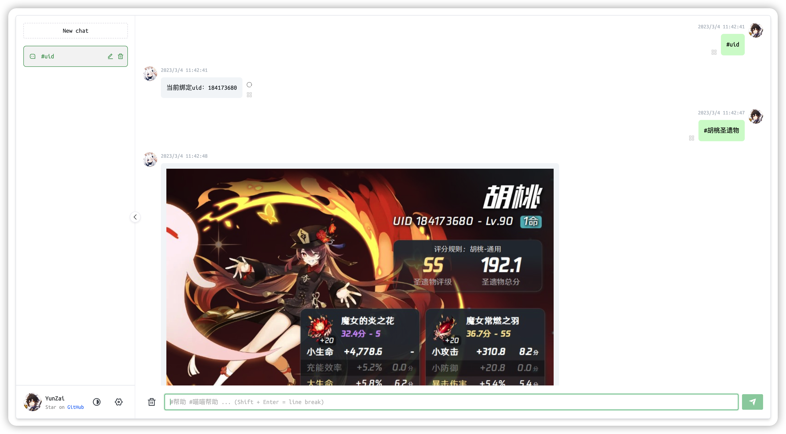
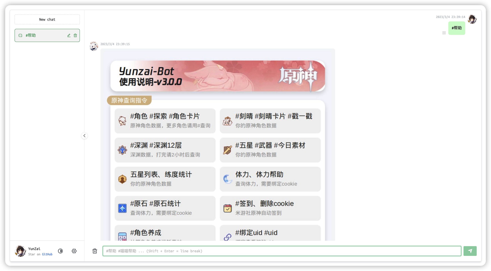
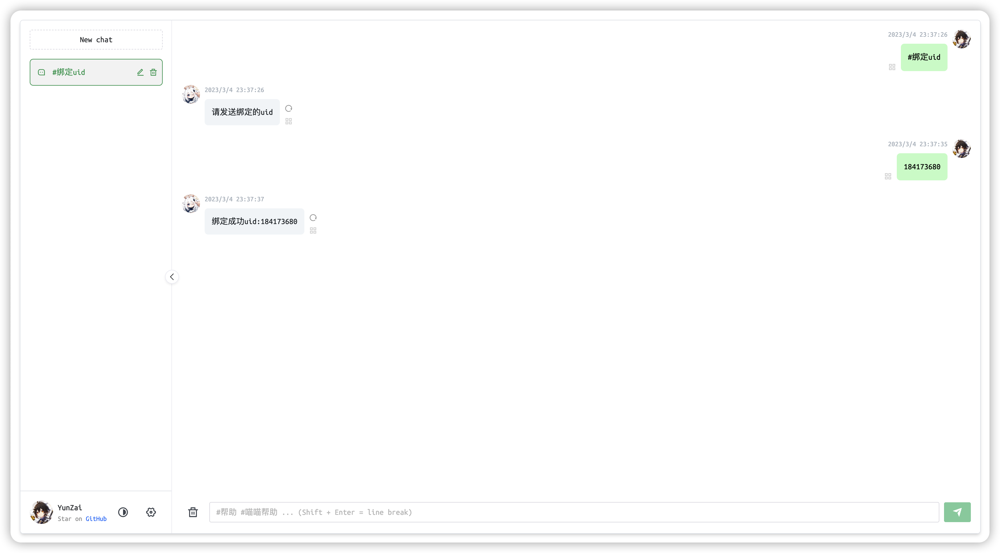
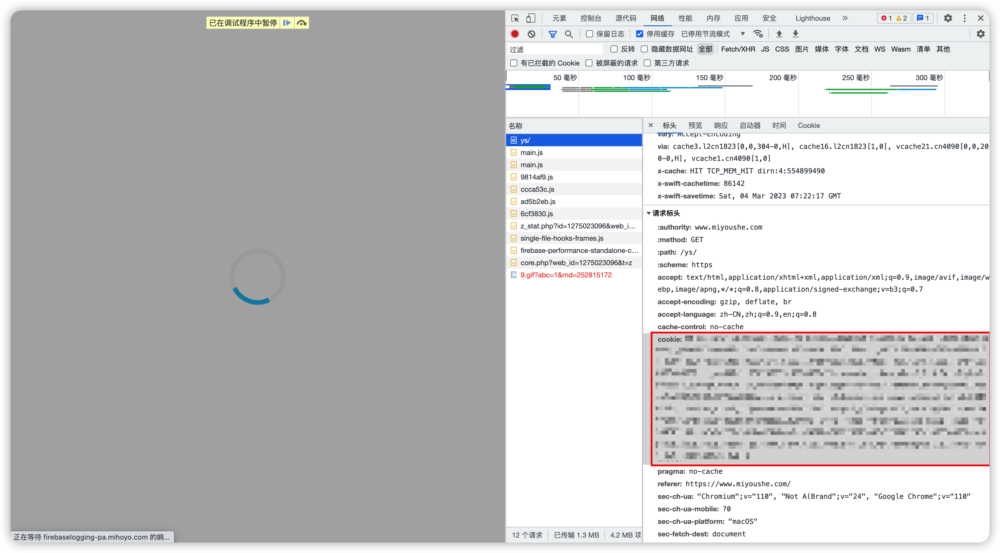
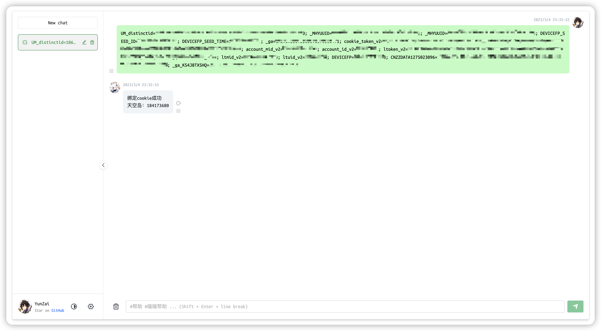

# Yunzai-Bot-Web

> 基于 Web 的 Yunzai-Bot 发行版，不依赖 QQ，极易部署！

Yunzai-Bot 是查询原神游戏信息的 QQ 机器人，但是 QQ 登录比较麻烦（小号、扫码、要求和设备同局域网..）。对于单纯只想查询原神面板信息的用户来说，或许并不想处理 QQ 登录的问题。

**Yunzai-Bot-Web** 提供了一种更轻量的部署方案！通过解除 Yunzai-Bot 对 QQ 的依赖，**Yunzai-Bot-Web** 可以进行零手工配置的部署，一行 `docker compose up -d` 即可开始使用～



## 快速上手

安装最新版本的 [Docker](https://docs.docker.com/engine/install/)

在合适的文件夹下新建 [docker-compose.yml](https://github.com/117503445/yunzai-bot-web/blob/master/docker-compose.yml)

```yaml
version: '3'

services:
  yunzai-web:
    image: registry.cn-hangzhou.aliyuncs.com/117503445-mirror/yunzai-web
    container_name: yunzai-web
    restart: unless-stopped
    ports:
      - 8080:8080
    depends_on:
      redis:
        condition: service_healthy
    volumes:
      - ./data/yunzai-web/yunzai-bot-data:/workspace/Yunzai-Bot/data # data of `Yunzai-Bot`
      - ./data/yunzai-web/be-images:/workspace/Yunzai-Bot/web-data/images # images of backend

      - ./config/plugins:/workspace/Yunzai-Bot/user_plugins # plugins of `Yunzai-Bot`
      # - ./config/config.json:/workspace/Yunzai-Bot/config.json # config of backend, unconment this line when config.json is provided

      - ./dev-data/vsc:/root/.vscode-server # vscode-server cache
  redis:
    image: registry.cn-hangzhou.aliyuncs.com/117503445-mirror/redis:alpine
    restart: unless-stopped
    volumes:
      - ./data/redis/data:/data
      - ./data/redis/logs:/logs
    healthcheck:
      test: [ "CMD", "redis-cli", "PING" ]
      start_period: 10s
      interval: 5s
      timeout: 1s
```

在此文件夹下运行命令

```sh
docker compose up -d
```

访问 <http://localhost:8080>

Enjoy :)

## 使用技巧

### 插件管理

以 [miao-plugin](https://gitee.com/yoimiya-kokomi/miao-plugin) 插件为例

#### 插件安装

先将插件下载至 `./config/plugins/` 目录

```sh
git clone --depth=1 https://gitee.com/yoimiya-kokomi/miao-plugin.git ./config/plugins/miao-plugin
```

重启容器，应用插件更新

```sh
docker compose down && docker compose up -d
```

#### 插件升级

拉取更改

```sh
cd ./config/plugins/miao-plugin
git pull
```

重启容器，应用插件更新

```sh
docker compose down && docker compose up -d
```


### 帮助

输入 `#帮助` 查看 Yunzai 的帮助

输入 `#喵喵帮助` 查看喵喵插件的帮助



### 绑定 uid



### 绑定 ck

ck 指的是 [米游社](https://www.miyoushe.com/ys) 的 cookie。Yunzai 在进行某些信息查询时需要用到 ck。

#### 油猴脚本[推荐]

可以通过油猴脚本，便捷的将 ck 发送至 Yunzai-Web。

详情见 <https://github.com/117503445/yunzai-bot-web/tree/master/script/miyoushe-token-sender>

#### 手动

在电脑上，登录 [米游社](https://www.miyoushe.com/ys)，打开浏览器的开发者工具，抓包，得到 cookie



然后将 cookie 直接发送即可完成绑定



### 多用户

默认情况下 **Yunzai-Bot-Web** 只支持单个原神用户。可以通过本节的配置，开启安全的多原神用户功能。

准备配置文件 `./config/config.json`

以下为配置文件示例。

```json
{
    "multiUser": false,
    "users": {
        "user1": {
            "password": "pass1",
            "qq": "10000000"
        },
        "user2": {
            "password": "pass2",
            "qq": "10000001"
        }
    }
}
```

定义了 2 个用户，分别是

- 用户名 user1 密码 pass1 QQ号 10000000
- 用户名 user2 密码 pass2 QQ号 10000001

QQ号字段不要求和真实 QQ 号一致，只要不同用户的 QQ 字段互相不同即可。其中 `10000000` 是 magic number, 表示 `user1` 是管理员。因为 `10000001` 不是 `10000000`, 所以 `user2` 是普通用户。

然后挂载配置文件即可

```yaml
    volumes:
      - ./config/config.json:/workspace/Yunzai-Bot/config.json
```

目前采用了 Basic Auth 方案，建议在网关上配置 HTTPS 以保障安全性。

### 镜像更新

当 `Yunzai-Bot` 或 `yunzai-bot-web` 更新时，需要通过本节描述的方法进行镜像更新。其中 `Yunzai-Bot` 基本已经停更了；`yunzai-bot-web` 修 bug 或者增添新功能(比较少见) 时会更新。

```sh
docker compose pull
docker compose up -d
```

### 脚本开发

可以编写脚本，进行一些自动化操作。例如 [yunzai-web-downloader](./script/yunzai-web-downloader/) 下载指定角色的面板、圣遗物，就不需要手动在 Web 面板上一个个问过来了。

### 调试

当 `yunzai-web` 出现非预期的故障时，需要进行调试。具体方法参考 [调试方法](./doc/dev.md)。

## 致谢

[Yunzai-Bot](https://gitee.com/Le-niao/Yunzai-Bot.git)

[miao-plugin](https://github.com/yoimiya-kokomi/miao-plugin.git)

[chatgpt-web](https://github.com/Chanzhaoyu/chatgpt-web)
