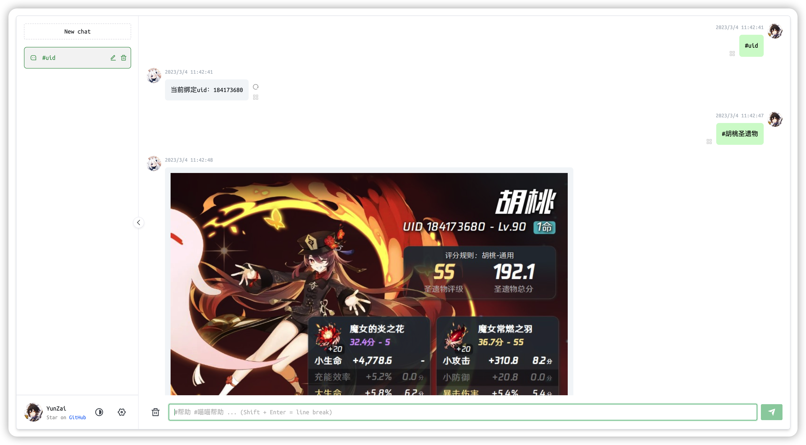
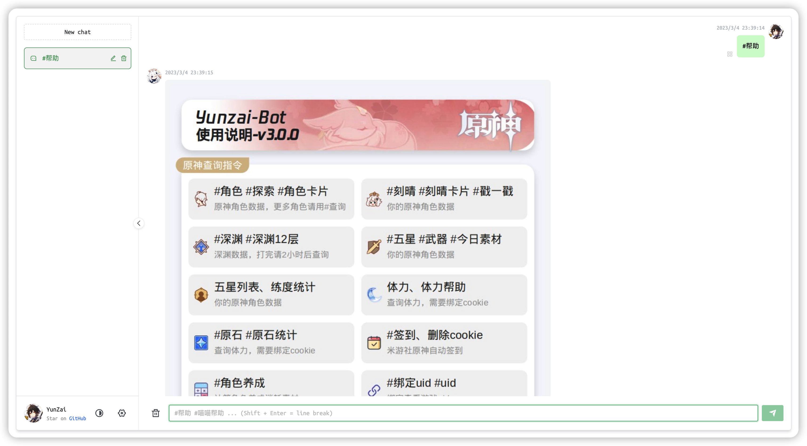
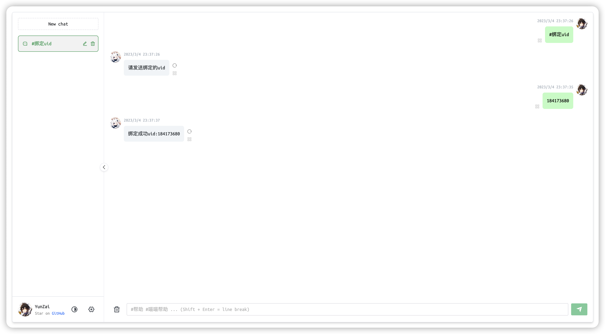
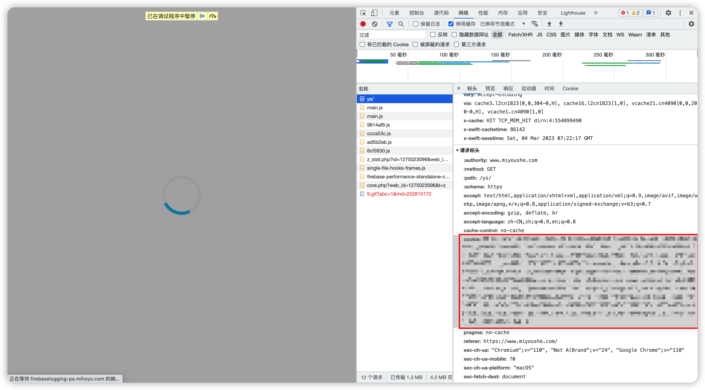
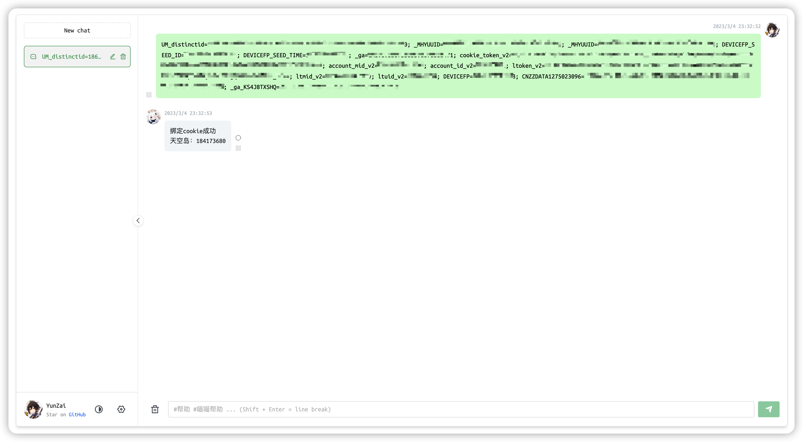

# Yunzai-Bot-Web

> 基于 Web 的 Yunzai-Bot 发行版，不依赖 QQ，极易部署！

Yunzai-Bot 是查询原神游戏信息的 QQ 机器人，但是 QQ 登录比较麻烦（小号、扫码、要求和设备同局域网..）。对于单纯只想查询原神面板信息的用户来说，或许并不想处理 QQ 登录的问题。

**Yunzai-Bot-Web** 提供了一种更轻量的部署方案！通过解除 Yunzai-Bot 对 QQ 的依赖，**Yunzai-Bot-Web** 可以进行零手工配置的部署，一行 `docker compose up -d` 即可开始使用～



## 快速上手

安装最新版本的 [Docker](https://docs.docker.com/engine/install/)

在合适的文件夹下新建 [docker-compose.yml](https://github.com/117503445/yunzai-bot-web/blob/master/docker-compose.yml)

```yaml
version: '3'

services:
  yunzai-web:
    # docker pull registry.cn-hangzhou.aliyuncs.com/117503445-mirror/yunzai-web && docker image tag registry.cn-hangzhou.aliyuncs.com/117503445-mirror/yunzai-web 117503445/yunzai-web
    image: 117503445/yunzai-web
    restart: unless-stopped
    ports:
      - 8080:8080
    depends_on:
      redis:
        condition: service_healthy
    # healthcheck:
    #   test: [ "CMD", "curl", "localhost:8080" ]
    #   start_period: 10s
    #   interval: 5s
    #   timeout: 1s
  redis:
    # docker pull registry.cn-hangzhou.aliyuncs.com/117503445-mirror/redis:alpine && docker image tag registry.cn-hangzhou.aliyuncs.com/117503445-mirror/redis:alpine redis:alpine
    image: redis:alpine
    restart: unless-stopped
    volumes:
      - ./_data/redis/data:/data
      - ./_data/redis/logs:/logs
    healthcheck:
      test: [ "CMD", "redis-cli", "PING" ]
      start_period: 10s
      interval: 5s
      timeout: 1s
```

[可选] 使用阿里云容器服务拉取镜像，速度更快

```sh
docker pull registry.cn-hangzhou.aliyuncs.com/117503445-mirror/yunzai-web && docker image tag registry.cn-hangzhou.aliyuncs.com/117503445-mirror/yunzai-web 117503445/yunzai-web
docker pull registry.cn-hangzhou.aliyuncs.com/117503445-mirror/redis:alpine && docker image tag registry.cn-hangzhou.aliyuncs.com/117503445-mirror/redis:alpine redis:alpine
```

在此文件夹下运行命令

```sh
docker compose up -d
```

访问 <http://localhost:8080>

Enjoy :)

## 使用技巧

### 帮助

输入 `#帮助` 查看 Yunzai 的帮助

输入 `#喵喵帮助` 查看喵喵插件的帮助



### 绑定 uid



### 绑定 ck

ck 指的是 [米游社](https://www.miyoushe.com/ys) 的 cookie。Yunzai 在进行某些信息查询时需要用到 ck。

在电脑上，登录 [米游社](https://www.miyoushe.com/ys)，打开浏览器的开发者工具，抓包，得到 cookie



然后将 cookie 直接发送即可完成绑定



## 致谢

[Yunzai-Bot](https://gitee.com/Le-niao/Yunzai-Bot.git)

[miao-plugin](https://github.com/yoimiya-kokomi/miao-plugin.git)

[chatgpt-web](https://github.com/Chanzhaoyu/chatgpt-web)
