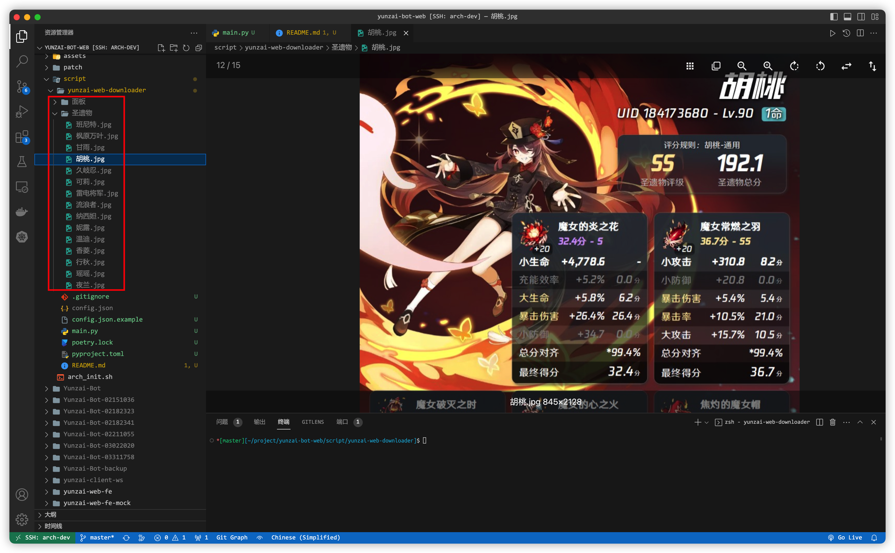

# Yunzai-web-downloader

基于 `Yunzai-Bot-Web` 获取指定角色的圣遗物和面板



## 使用方法

1. 安装依赖

    ```sh
    poetry install
    ```

2. 将 `config.json.examle` 粘贴为 `config.json`，填写对应字段

3. 运行命令

    ```sh
    poetry run python main.py
    ```
